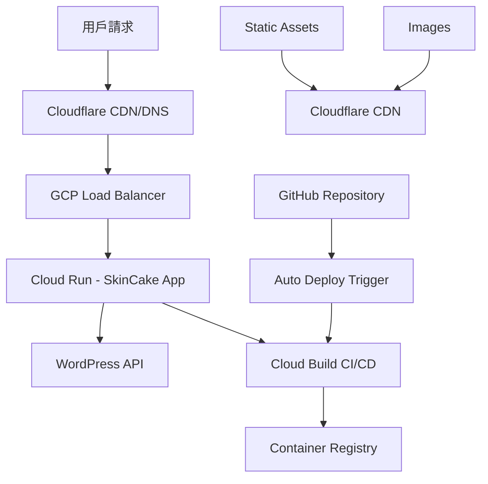

# SkinCake V2.0.0 部署指南 - GCP + Cloudflare 混合雲架構

> **版本**: V2.0.0 已部署  
> **部署狀態**: ✅ 生產環境運行中  
> **更新日期**: 2025/07/15  
> **架構**: Next.js 14 + GCP Cloud Run + Cloudflare CDN  

---

## 🎯 **部署架構總覽**



---

## ✅ **當前部署狀態**

### 🚀 **生產環境**
- **服務**: `skincake-app`
- **平台**: GCP Cloud Run
- **區域**: `asia-east1` (台灣)
- **狀態**: ✅ 運行中
- **版本**: V2.0.0 (2025/07/15)

### 🔄 **自動化 CI/CD**
- **觸發**: GitHub `main` 分支 push
- **建置**: Cloud Build (`cloudbuild.yaml`)
- **部署**: 自動部署到 Cloud Run
- **狀態**: ✅ 完全自動化

### 📊 **資源配置**
```yaml
CPU: 1 vCPU
Memory: 2GB RAM
Min Instances: 0
Max Instances: 100
Timeout: 300s
Port: 3000
```

---

## 🛠️ **部署設定詳情**

### 1. **Cloud Build 配置** (`cloudbuild.yaml`)
```yaml
steps:
  # Build Docker image
  - name: 'gcr.io/cloud-builders/docker'
    args: ['build', '-t', 'gcr.io/$PROJECT_ID/skincake-app:$BUILD_ID', '.']
  
  # Push to Container Registry
  - name: 'gcr.io/cloud-builders/docker'
    args: ['push', 'gcr.io/$PROJECT_ID/skincake-app:$BUILD_ID']
  
  # Deploy to Cloud Run
  - name: 'gcr.io/cloud-builders/gcloud'
    args:
      - 'run'
      - 'deploy'
      - 'skincake-app'
      - '--image'
      - 'gcr.io/$PROJECT_ID/skincake-app:$BUILD_ID'
      - '--region'
      - 'asia-east1'
      - '--platform'
      - 'managed'
      - '--allow-unauthenticated'
      - '--memory'
      - '2Gi'
      - '--cpu'
      - '1'
      - '--max-instances'
      - '100'
      - '--timeout'
      - '300'

options:
  logging: CLOUD_LOGGING_ONLY
```

### 2. **Dockerfile 優化**
```dockerfile
FROM node:18-alpine AS base

# Install dependencies
FROM base AS deps
WORKDIR /app
COPY package.json package-lock.json ./
RUN npm ci --omit=dev

# Build application
FROM base AS builder
WORKDIR /app
COPY package.json package-lock.json ./
RUN npm ci
COPY . .
RUN npm run build

# Production image
FROM base AS runner
WORKDIR /app
ENV NODE_ENV production

# Copy built application
COPY --from=builder /app/.next/standalone ./
COPY --from=builder /app/.next/static ./.next/static
COPY --from=builder /app/public ./public

EXPOSE 3000
ENV PORT 3000
ENV HOSTNAME "0.0.0.0"

CMD ["node", "server.js"]
```

### 3. **環境變數配置**
```bash
# Next.js 配置
NODE_ENV=production
NEXT_TELEMETRY_DISABLED=1

# WordPress API
WORDPRESS_API_URL=https://skincake.online/wp-json/wp/v2

# 監控配置
GOOGLE_CLOUD_PROJECT=your-project-id
```

---

## 💰 **成本優化 - Cloudflare 混合方案**

### 🌐 **Phase 1: Cloudflare 基礎整合**

#### DNS 與 SSL 設定
```bash
# 1. 在 Cloudflare 新增域名
# 2. 更新 Nameservers 到 Cloudflare
# 3. 設定 CNAME 記錄
your-domain.com CNAME skincake-app-xxxx.a.run.app

# 4. 啟用 SSL/TLS (Full Strict)
# 5. 開啟 Auto HTTPS Rewrites
```

#### CDN 快取規則
```javascript
// Cloudflare Page Rules
Rule 1: /_next/static/* 
  - Cache Level: Cache Everything
  - Edge Cache TTL: 1 month
  - Browser Cache TTL: 1 month

Rule 2: /images/*
  - Cache Level: Cache Everything  
  - Edge Cache TTL: 1 week
  - Browser Cache TTL: 1 week

Rule 3: /api/*
  - Cache Level: Bypass
```

### 🚀 **Phase 2: Workers 快取優化**

#### WordPress API 快取 Worker
```javascript
// cloudflare-worker.js
addEventListener('fetch', event => {
  event.respondWith(handleRequest(event.request))
})

async function handleRequest(request) {
  const cache = caches.default
  const cacheKey = new Request(request.url, request)
  
  // 檢查快取
  let response = await cache.match(cacheKey)
  
  if (!response) {
    // 快取未命中，從源伺服器獲取
    response = await fetch(request)
    
    // 只快取 GET 請求且狀態為 200
    if (request.method === 'GET' && response.status === 200) {
      response = new Response(response.body, {
        status: response.status,
        statusText: response.statusText,
        headers: {
          ...response.headers,
          'Cache-Control': 'public, max-age=300', // 5分鐘快取
          'CF-Cache-Status': 'MISS'
        }
      })
      
      event.waitUntil(cache.put(cacheKey, response.clone()))
    }
  } else {
    // 快取命中
    response = new Response(response.body, {
      ...response,
      headers: {
        ...response.headers,
        'CF-Cache-Status': 'HIT'
      }
    })
  }
  
  return response
}
```

### 💡 **Phase 3: 圖片優化**

#### Cloudflare Images 整合
```typescript
// lib/image-optimizer.ts
export function getOptimizedImageUrl(
  originalUrl: string,
  width?: number,
  height?: number,
  format: 'webp' | 'avif' | 'auto' = 'auto'
): string {
  const cfImageUrl = `https://imagedelivery.net/${ACCOUNT_HASH}/${IMAGE_ID}`
  
  const params = new URLSearchParams()
  if (width) params.set('w', width.toString())
  if (height) params.set('h', height.toString())
  params.set('f', format)
  params.set('q', '85') // 品質 85%
  
  return `${cfImageUrl}?${params.toString()}`
}
```

---

## 📊 **監控與維護**

### 🔍 **監控指標**

#### Cloud Run 監控
```bash
# CPU 使用率
gcloud monitoring metrics list --filter="metric.type:run.googleapis.com/container/cpu/utilizations"

# 記憶體使用率  
gcloud monitoring metrics list --filter="metric.type:run.googleapis.com/container/memory/utilizations"

# 請求計數
gcloud monitoring metrics list --filter="metric.type:run.googleapis.com/request_count"
```

#### Cloudflare Analytics
- **頻寬節省**: 追蹤 CDN 命中率
- **性能改善**: 測量全球延遲改善
- **安全統計**: 阻擋的威脅數量

### 🚨 **告警設定**
```yaml
# Cloud Monitoring 告警
alertPolicy:
  displayName: "SkinCake High CPU Usage"
  conditions:
    - displayName: "CPU utilization high"
      conditionThreshold:
        filter: 'resource.type="cloud_run_revision"'
        comparison: COMPARISON_GT
        thresholdValue: 0.8
        duration: "300s"
  notificationChannels:
    - "projects/PROJECT_ID/notificationChannels/CHANNEL_ID"
```

---

## 🔄 **部署流程詳解**

### 📝 **標準部署步驟**

#### 1. 代碼提交觸發
```bash
# 本地開發完成後
git add .
git commit -m "feat: implement new feature"
git push origin main

# 自動觸發 Cloud Build
# ✅ 建置 Docker image
# ✅ 推送到 Container Registry  
# ✅ 部署到 Cloud Run
# ✅ 健康檢查通過
```

#### 2. 手動部署 (緊急情況)
```bash
# 建置並推送 image
gcloud builds submit --tag gcr.io/PROJECT_ID/skincake-app

# 部署到 Cloud Run
gcloud run deploy skincake-app \
  --image gcr.io/PROJECT_ID/skincake-app \
  --region asia-east1 \
  --platform managed \
  --allow-unauthenticated \
  --memory 2Gi \
  --cpu 1
```

#### 3. 回滾部署
```bash
# 查看歷史版本
gcloud run revisions list --service=skincake-app --region=asia-east1

# 回滾到特定版本
gcloud run services update-traffic skincake-app \
  --to-revisions=REVISION_NAME=100 \
  --region=asia-east1
```

---

## 🛡️ **安全性配置**

### 🔐 **GCP 安全設定**

#### IAM 權限管理
```bash
# Cloud Run 服務帳戶
gcloud iam service-accounts create skincake-service-account \
  --description="SkinCake Cloud Run service account" \
  --display-name="SkinCake Service Account"

# 分配最小權限
gcloud projects add-iam-policy-binding PROJECT_ID \
  --member="serviceAccount:skincake-service-account@PROJECT_ID.iam.gserviceaccount.com" \
  --role="roles/run.invoker"
```

#### Secret Manager 整合
```bash
# 建立機密
gcloud secrets create wordpress-api-key --data-file=api-key.txt

# 授權 Cloud Run 存取
gcloud secrets add-iam-policy-binding wordpress-api-key \
  --member="serviceAccount:skincake-service-account@PROJECT_ID.iam.gserviceaccount.com" \
  --role="roles/secretmanager.secretAccessor"
```

### 🛡️ **Cloudflare 安全功能**

#### WAF 規則配置
```javascript
// 自定義 WAF 規則
Rule 1: Block malicious requests
  - Expression: (http.request.uri contains "wp-admin")
  - Action: Block

Rule 2: Rate limiting  
  - Expression: (http.request.uri.path eq "/api/")
  - Action: Rate limit (10 req/min)

Rule 3: Geo blocking
  - Expression: (ip.geoip.country ne "TW" and ip.geoip.country ne "US")
  - Action: Challenge (CAPTCHA)
```

---

## 📈 **性能優化策略**

### ⚡ **建置優化**

#### Next.js 配置優化
```javascript
// next.config.js
module.exports = {
  output: 'standalone',
  images: {
    remotePatterns: [
      {
        protocol: 'https',
        hostname: 'skincake.online',
      },
      {
        protocol: 'https', 
        hostname: 'imagedelivery.net',
      }
    ],
    formats: ['image/avif', 'image/webp'],
  },
  experimental: {
    optimizeCss: true,
    optimizeServerReact: true,
  },
  compiler: {
    removeConsole: process.env.NODE_ENV === 'production',
  }
}
```

#### Bundle 分析
```bash
# 安裝分析工具
npm install --save-dev @next/bundle-analyzer

# 分析 bundle 大小
npm run build
npm run analyze
```

### 🚀 **Runtime 優化**

#### 預載入策略
```typescript
// components/Layout.tsx
import Link from 'next/link'

export default function Layout({ children }) {
  return (
    <>
      {/* 預載入關鍵頁面 */}
      <Link href="/blog" prefetch={true}>
        部落格
      </Link>
      <Link href="/category" prefetch={true}>
        分類
      </Link>
      {children}
    </>
  )
}
```

---

## 🔧 **故障排除指南**

### 🚨 **常見問題處理**

#### 1. 部署失敗
```bash
# 檢查 Cloud Build 日誌
gcloud builds list --limit=5
gcloud builds log BUILD_ID

# 檢查 Cloud Run 日誌
gcloud logs read "resource.type=cloud_run_revision" --limit=50
```

#### 2. 記憶體不足
```bash
# 增加記憶體配置
gcloud run services update skincake-app \
  --memory 4Gi \
  --region asia-east1
```

#### 3. WordPress API 連線問題
```typescript
// lib/wordpress-api.ts 錯誤處理
async function fetchWithRetry(url: string, retries = 3): Promise<Response> {
  for (let i = 0; i < retries; i++) {
    try {
      const response = await fetch(url, {
        headers: { 'User-Agent': 'SkinCake/2.0' },
        next: { revalidate: 300 } // 5分鐘快取
      })
      
      if (!response.ok) {
        throw new Error(`HTTP ${response.status}`)
      }
      
      return response
    } catch (error) {
      if (i === retries - 1) throw error
      await new Promise(resolve => setTimeout(resolve, 1000 * (i + 1)))
    }
  }
}
```

---

## 📋 **維護檢查清單**

### 🔄 **每日檢查**
- [ ] Cloud Run 服務狀態正常
- [ ] 錯誤日誌檢查 (< 1% 錯誤率)
- [ ] Cloudflare 快取命中率 (> 90%)
- [ ] 網站載入速度 (< 2秒)

### 📊 **每週檢查** 
- [ ] GCP 費用監控
- [ ] 安全掃描報告
- [ ] 性能指標趨勢
- [ ] 備份驗證

### 🔧 **每月維護**
- [ ] 依賴套件更新
- [ ] 安全補丁檢查  
- [ ] 快取策略優化
- [ ] 容量規劃評估

---

## 🎯 **下一步優化計劃**

### 🚀 **短期目標** (2025/07/18-07/25)
1. **完成 Cloudflare Workers 快取**
2. **實施圖片優化服務**
3. **設定完整監控告警**
4. **優化 Core Web Vitals**

### 🌟 **中期目標** (2025/08/01-08/15)
1. **多區域部署** (asia-northeast1 備援)
2. **CI/CD 流程完善** (自動測試、段階部署)
3. **災難恢復計劃** (RTO < 1小時)
4. **性能基準測試** (壓力測試)

---

<div align="center">

**🎉 SkinCake V2.0.0 - 已成功部署到生產環境**

*GCP Cloud Run + Cloudflare CDN 混合雲架構*

**下一個里程碑**: 完成 Cloudflare 深度整合，實現 60% 成本節省 💰

</div> 