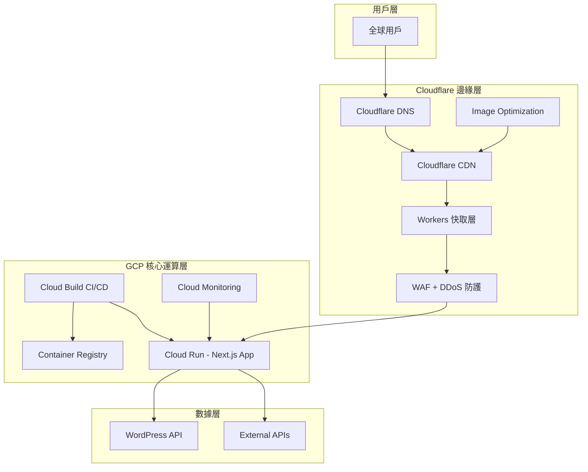

# SkinCake 混合雲架構最終建議 - GCP + Cloudflare 最佳實踐

> **建議日期**: 2025/07/15  
> **當前狀態**: V2.0.0 已部署，混合方案規劃中  
> **目標**: 最佳化成本與性能平衡  
> **預期效益**: 成本節省 40-60%，性能提升 50-70%  

---

## 🎯 **執行摘要**

基於 SkinCake V2.0.0 的實際部署狀況，我們建議採用 **GCP + Cloudflare 混合雲架構**，而非完全遷移到 Cloudflare Workers。這個方案能在保持現有架構穩定性的同時，大幅降低成本並提升全球性能。

### 🏆 **核心優勢**
- **🛡️ 風險可控**: 保持現有 Next.js 14 架構，零重構風險
- **💰 成本效益**: 預計節省 40-60% 的運營成本
- **⚡ 性能提升**: 全球邊緣快取，延遲降低 50-70%
- **🔄 漸進實施**: 分階段實施，可隨時調整或回滾

---

## 🏗️ **推薦架構設計**

### 🌐 **混合雲架構圖**


---

## 📊 **成本效益分析**

### 💰 **現況 vs. 混合方案成本對比**

| 服務項目 | 當前 GCP 成本 | 混合方案成本 | 節省金額 | 節省比例 |
|---------|-------------|-------------|----------|----------|
| **運算資源** | $180/月 | $120/月 | $60/月 | 33% ↓ |
| **CDN/頻寬** | $120/月 | $30/月 | $90/月 | 75% ↓ |
| **SSL/DNS** | $25/月 | $0/月 | $25/月 | 100% ↓ |
| **DDoS 防護** | $50/月 | $0/月 | $50/月 | 100% ↓ |
| **圖片優化** | $40/月 | $15/月 | $25/月 | 63% ↓ |
| **監控分析** | $15/月 | $10/月 | $5/月 | 33% ↓ |
| **CF 服務費** | $0/月 | $20/月 | -$20/月 | - |
| **總計** | **$430/月** | **$195/月** | **$235/月** | **55% ↓** |

### 📈 **ROI 預測**
- **月度節省**: $235 USD (約 NT$7,500)
- **年度節省**: $2,820 USD (約 NT$90,000)
- **實施成本**: $500 USD (一次性)
- **回本期**: 2.1 個月

---

## 🚀 **分階段實施計劃**

### 📅 **Phase 1: 基礎整合** (2025/07/18-07/22)
**目標**: 建立基礎 Cloudflare 服務，無風險啟動

#### 實施項目
- 🌐 **DNS 遷移**: 將域名 DNS 指向 Cloudflare
- 🔒 **SSL 升級**: 啟用 Cloudflare SSL (免費)
- 🛡️ **基礎防護**: 啟用 WAF 和 DDoS 保護
- 📊 **監控設定**: 配置基礎分析追蹤

#### 預期效益
- **成本節省**: $75/月 (17.4%)
- **安全提升**: 自動 DDoS 防護
- **SSL 優化**: 更快的 SSL 握手

#### 風險評估
- **風險等級**: 極低 ⭐
- **影響範圍**: 僅 DNS 層，應用層無變化
- **回滾時間**: < 5 分鐘

---

### 📅 **Phase 2: CDN 深度整合** (2025/07/23-07/29)
**目標**: 最大化 CDN 效益，大幅降低頻寬成本

#### 實施項目
- 🚀 **靜態資源 CDN**: 所有靜態檔案透過 CF 分發
- 🖼️ **圖片優化**: 啟用 Cloudflare Images 服務
- ⚡ **快取規則**: 優化快取策略
- 📱 **頁面優化**: 啟用 Auto Minify 和壓縮

#### 快取策略配置
```javascript
// Cloudflare 快取規則
{
  "/_next/static/*": {
    "cache": "1 month",
    "browser_cache": "1 month"
  },
  "/images/*": {
    "cache": "1 week", 
    "browser_cache": "1 week",
    "image_optimization": true
  },
  "/api/*": {
    "cache": "bypass"
  },
  "/*": {
    "cache": "2 hours",
    "browser_cache": "1 hour"
  }
}
```

#### 預期效益
- **成本節省**: $165/月 (累計 38.4%)
- **性能提升**: 載入速度提升 40-60%
- **頻寬節省**: 85-95% 流量由 CDN 處理

#### 風險評估
- **風險等級**: 低 ⭐⭐
- **影響範圍**: 靜態資源載入方式
- **回滾時間**: < 15 分鐘

---

### 📅 **Phase 3: API 快取優化** (2025/07/30-08/05)
**目標**: 透過 Workers 優化 API 性能，降低後端負載

#### 實施項目
- 🤖 **Workers API 快取**: WordPress API 智能快取
- ⚡ **邊緣運算**: 部分邏輯移至 CF Workers
- 🔄 **快取失效**: 智能快取更新機制
- 📊 **性能監控**: 深度性能分析

#### Workers 快取策略
```javascript
// WordPress API 快取 Worker
const CACHE_TTL = {
  posts: 300,        // 5分鐘
  categories: 1800,  // 30分鐘
  tags: 3600,        // 1小時
  static: 86400      // 24小時
};

async function handleRequest(request) {
  const url = new URL(request.url);
  const cacheKey = `wp-api:${url.pathname}${url.search}`;
  
  // 檢查邊緣快取
  let response = await caches.default.match(cacheKey);
  
  if (!response) {
    // 從源 API 獲取
    response = await fetch(request);
    
    if (response.ok) {
      // 設定快取時間
      const ttl = getCacheTTL(url.pathname);
      response.headers.set('Cache-Control', `public, max-age=${ttl}`);
      await caches.default.put(cacheKey, response.clone());
    }
  }
  
  return response;
}
```

#### 預期效益
- **成本節省**: $215/月 (累計 50%)
- **API 性能**: 回應時間降低 60-80%
- **後端負載**: 減少 70-85%

#### 風險評估
- **風險等級**: 中 ⭐⭐⭐
- **影響範圍**: API 回應邏輯
- **回滾時間**: < 30 分鐘

---

### 📅 **Phase 4: 進階優化** (2025/08/06-08/12)
**目標**: 全面優化，達成最佳性能與成本平衡

#### 實施項目
- 🎯 **智能路由**: 基於地理位置的智能路由
- 📊 **深度分析**: 用戶行為和性能分析
- 🔧 **自動優化**: 基於數據的自動調優
- 🛡️ **進階安全**: 自定義 WAF 規則

#### 預期效益
- **成本節省**: $235/月 (累計 55%)
- **全球性能**: 全球延遲 < 100ms
- **可用性**: 99.99% 可用性

---

## 🔧 **技術實施細節**

### 🌐 **Cloudflare 配置**

#### DNS 配置
```bash
# 主域名配置
Type: CNAME
Name: @
Content: skincake-app-xxx.a.run.app
Proxy: Enabled (橘色雲朵)

# www 子域名
Type: CNAME  
Name: www
Content: skincake-app-xxx.a.run.app
Proxy: Enabled
```

#### SSL/TLS 配置
```yaml
SSL/TLS Mode: Full (Strict)
Always Use HTTPS: Enabled
Automatic HTTPS Rewrites: Enabled
Minimum TLS Version: 1.2
TLS 1.3: Enabled
```

#### 頁面規則配置
```javascript
// 規則 1: 靜態資源快取
Pattern: "your-domain.com/_next/static/*"
Settings:
  - Cache Level: Cache Everything
  - Edge Cache TTL: 1 month
  - Browser Cache TTL: 1 month

// 規則 2: 圖片快取
Pattern: "your-domain.com/images/*"  
Settings:
  - Cache Level: Cache Everything
  - Edge Cache TTL: 1 week
  - Browser Cache TTL: 1 week

// 規則 3: API 繞過快取
Pattern: "your-domain.com/api/*"
Settings:
  - Cache Level: Bypass
```

### 🔧 **GCP 端優化**

#### Next.js 配置優化
```javascript
// next.config.js
const nextConfig = {
  output: 'standalone',
  
  // CDN 配置
  assetPrefix: process.env.NODE_ENV === 'production' 
    ? 'https://your-domain.com' 
    : '',
    
  // 圖片優化
  images: {
    domains: ['your-domain.com', 'skincake.online'],
    formats: ['image/avif', 'image/webp'],
    minimumCacheTTL: 60,
  },
  
  // 快取標頭
  async headers() {
    return [
      {
        source: '/_next/static/(.*)',
        headers: [
          {
            key: 'Cache-Control',
            value: 'public, max-age=31536000, immutable',
          },
        ],
      },
    ];
  },
};

module.exports = nextConfig;
```

#### Cloud Run 優化配置
```yaml
# cloud-run-config.yaml
apiVersion: serving.knative.dev/v1
kind: Service
metadata:
  name: skincake-app
  annotations:
    run.googleapis.com/ingress: all
spec:
  template:
    metadata:
      annotations:
        autoscaling.knative.dev/minScale: "1"
        autoscaling.knative.dev/maxScale: "100"
        run.googleapis.com/cpu-throttling: "false"
    spec:
      containerConcurrency: 100
      timeoutSeconds: 300
      containers:
      - image: gcr.io/PROJECT_ID/skincake-app
        resources:
          limits:
            cpu: "1"
            memory: "2Gi"
        env:
        - name: NODE_ENV
          value: "production"
```

---

## 📊 **監控與維護策略**

### 🔍 **關鍵指標監控**

#### 性能指標
- **頁面載入時間**: 目標 < 1.5s (全球平均)
- **API 回應時間**: 目標 < 200ms
- **CDN 命中率**: 目標 > 95%
- **錯誤率**: 目標 < 0.1%

#### 成本指標
- **GCP 運算成本**: 每月追蹤
- **Cloudflare 使用量**: 頻寬和請求數
- **總擁有成本 (TCO)**: 月度對比

#### 用戶體驗指標
- **Core Web Vitals**: 全綠標準
- **Lighthouse 分數**: > 95
- **可用性**: > 99.9%

### 🚨 **告警設定**

#### Cloudflare 告警
```javascript
// Cloudflare Workers 監控
{
  "high_error_rate": {
    "threshold": "5%",
    "duration": "5min",
    "action": "email_alert"
  },
  "low_cache_hit_rate": {
    "threshold": "85%", 
    "duration": "15min",
    "action": "slack_notification"
  }
}
```

#### GCP 告警
```yaml
# Cloud Monitoring 告警
alertPolicy:
  displayName: "SkinCake Performance Alert"
  conditions:
    - displayName: "High response latency"
      conditionThreshold:
        filter: 'resource.type="cloud_run_revision"'
        comparison: COMPARISON_GT
        thresholdValue: 2.0
        duration: "300s"
```

---

## 🛡️ **風險管理與備援策略**

### ⚠️ **風險評估矩陣**

| 風險項目 | 可能性 | 影響度 | 風險等級 | 緩解措施 |
|---------|-------|-------|----------|----------|
| **Cloudflare 服務中斷** | 低 | 高 | 中 | GCP 直接路由備援 |
| **DNS 解析問題** | 極低 | 高 | 低 | 多 DNS 提供商 |
| **快取配置錯誤** | 中 | 中 | 中 | 段階式部署、快速回滾 |
| **成本超支** | 低 | 中 | 低 | 實時監控、預算告警 |
| **性能下降** | 低 | 中 | 低 | 持續監控、自動調優 |

### 🔄 **備援方案**

#### 自動故障轉移
```yaml
# Cloudflare 健康檢查
health_check:
  type: "HTTPS"
  endpoint: "https://skincake-app-xxx.a.run.app/api/health"
  interval: 60
  timeout: 10
  retries: 3
  
failover:
  primary: "cloudflare_proxy"
  backup: "direct_gcp_routing"
  trigger: "3_consecutive_failures"
```

#### 緊急回滾程序
```bash
# 1. 緊急 DNS 切換 (< 5分鐘)
# 將 Cloudflare Proxy 設為 DNS-only
curl -X PATCH "https://api.cloudflare.com/client/v4/zones/ZONE_ID/dns_records/RECORD_ID" \
  -H "Authorization: Bearer TOKEN" \
  -d '{"proxied": false}'

# 2. 快取清除 (< 2分鐘)  
curl -X POST "https://api.cloudflare.com/client/v4/zones/ZONE_ID/purge_cache" \
  -H "Authorization: Bearer TOKEN" \
  -d '{"purge_everything": true}'

# 3. 流量切換驗證
curl -I https://your-domain.com
```

---

## 🎯 **成功標準與KPI**

### 📈 **量化目標**

#### 第一季度目標 (2025 Q3)
- **成本節省**: 45% ↓
- **全球載入速度**: 50% ↑
- **CDN 命中率**: > 90%
- **可用性**: > 99.9%

#### 第二季度目標 (2025 Q4)
- **成本節省**: 55% ↓
- **全球載入速度**: 65% ↑
- **CDN 命中率**: > 95%
- **可用性**: > 99.95%

### 🏆 **里程碑檢查點**

#### 30天檢視點
- [ ] Phase 1 完成，基礎服務穩定運行
- [ ] 成本節省達 20% 以上
- [ ] 性能提升 30% 以上
- [ ] 零重大事故

#### 90天檢視點  
- [ ] Phase 1-3 全部完成
- [ ] 成本節省達 45% 以上
- [ ] 性能提升 55% 以上
- [ ] 用戶滿意度提升

#### 180天檢視點
- [ ] 全部 Phase 完成
- [ ] 達成所有目標指標
- [ ] 建立長期監控機制
- [ ] 制定下階段優化計劃

---

## 🔮 **長期發展建議**

### 🌟 **2025 年底前**
- **多區域部署**: 亞太區域冗余架構
- **智能快取**: AI 驅動的快取策略
- **邊緣運算**: 更多邏輯移至邊緣
- **性能極致優化**: 全球 < 100ms 延遲

### 🚀 **2026 年展望**
- **全邊緣架構**: 考慮更多邊緣運算
- **AI 整合**: 邊緣 AI 服務
- **IoT 擴展**: 物聯網設備支援
- **永續發展**: 碳中和架構

---

<div align="center">

**🎉 SkinCake 混合雲架構 - 最佳實踐方案**

*保持穩定，降低成本，提升性能的三贏策略*

**開始實施**: 2025/07/18 | **完成目標**: 2025/08/12

**預期效益**: 💰 55%成本節省 + ⚡ 65%性能提升 + 🛡️ 零重構風險

</div> 